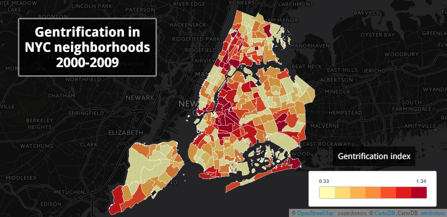

This project was aimed to construct a Gentrification index that could asses the rate of gentrification in different 
areas of New York City; the index includes data from Median house value, median rent values, % of white population in 
the area, % of college graduates in the areas, poverty levels and median household income; the selected area to evaluate
the project was Neighborhood, altought the data was obtained in a census tract form.

Evaluation were made for two periods of time : 2000-2009 and 2010-2013.
Using a Rook polygon contiguity criteria, assesment of the dinamic evolution of gentrification based on the 
gentrification index were made between thee top gentrifying neighborhoods by 2009 and the adjacent areas
in 2013. 

Maps with the results were plotted in Carto DB to show the range of the scores of the composed index for all 
New York City Neighborhoods.

